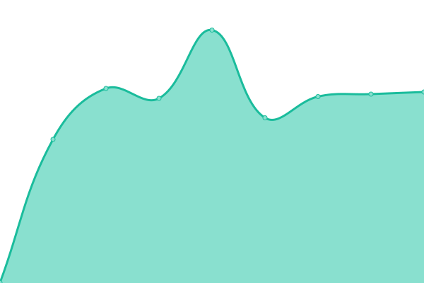

# [📈 Live Status](https://LightingControl.github.io/devmonitor): <!--live status--> **🟩 All systems operational**

This repository contains the open-source uptime monitor and status page for [LCD ](https://LightingControl.github.io/devmonitor), powered by [Upptime](https://github.com/upptime/upptime).

With [Upptime](https://upptime.js.org), you can get your own unlimited and free uptime monitor and status page, powered entirely by a GitHub repository. We use [Issues](https://github.com/LightingControl/devmonitor/issues) as incident reports, [Actions](https://github.com/LightingControl/devmonitor/actions) as uptime monitors, and [Pages](https://LightingControl.github.io/devmonitor) for the status page.

<!--start: status pages-->
<!-- This summary is generated by Upptime (https://github.com/upptime/upptime) -->
<!-- Do not edit this manually, your changes will be overwritten -->
<!-- prettier-ignore -->
| URL | Status | History | Response Time | Uptime |
| --- | ------ | ------- | ------------- | ------ |
|  [API DEV](https://api-dev.centro.network/swagger/index.html) | 🟩 Up | [api-dev.yml](https://github.com/LightingControl/Centro-devmonitor/commits/HEAD/history/api-dev.yml) | 

 581ms
     
 | 

<a href="https://devmon.centro.network/history/api-dev">99.32%</a>
    

|  [Frontend DEV](https://dev.centro.network/api/health) | 🟩 Up | [frontend-dev.yml](https://github.com/LightingControl/Centro-devmonitor/commits/HEAD/history/frontend-dev.yml) | 

 550ms
     
 | 

<a href="https://devmon.centro.network/history/frontend-dev">100.00%</a>
    

|  [App DEV](https://app-dev.centro.network) | 🟩 Up | [app-dev.yml](https://github.com/LightingControl/Centro-devmonitor/commits/HEAD/history/app-dev.yml) | 

 521ms
     
 | 

<a href="https://devmon.centro.network/history/app-dev">98.14%</a>
    

|  [API STAGE](https://api-stage.centro.network/swagger/index.html) | 🟩 Up | [api-stage.yml](https://github.com/LightingControl/Centro-devmonitor/commits/HEAD/history/api-stage.yml) | 

 558ms
     
 | 

<a href="https://devmon.centro.network/history/api-stage">99.18%</a>
    

|  [Frontend STAGE](https://stage.centro.network/api/health) | 🟩 Up | [frontend-stage.yml](https://github.com/LightingControl/Centro-devmonitor/commits/HEAD/history/frontend-stage.yml) | 

 541ms
     
 | 

<a href="https://devmon.centro.network/history/frontend-stage">99.40%</a>
    

|  [App STAGE](https://app-stage.centro.network) | 🟩 Up | [app-stage.yml](https://github.com/LightingControl/Centro-devmonitor/commits/HEAD/history/app-stage.yml) | 

 521ms
     
 | 

<a href="https://devmon.centro.network/history/app-stage">99.40%</a>
    

|  [ADMIN PANEL](https://admin.centro.network) | 🟩 Up | [admin-panel.yml](https://github.com/LightingControl/Centro-devmonitor/commits/HEAD/history/admin-panel.yml) | 

 890ms
     
 | 

<a href="https://devmon.centro.network/history/admin-panel">100.00%</a>
    

|  [ADMIN Licence and Translations](https://strapi.centro.network) | 🟩 Up | [admin-licence-and-translations.yml](https://github.com/LightingControl/Centro-devmonitor/commits/HEAD/history/admin-licence-and-translations.yml) | 

 497ms
     
 | 

<a href="https://devmon.centro.network/history/admin-licence-and-translations">100.00%</a>
    

|  [WEBSITE](https://cms.centro.network) | 🟩 Up | [website.yml](https://github.com/LightingControl/Centro-devmonitor/commits/HEAD/history/website.yml) | 

 481ms
     
 | 

<a href="https://devmon.centro.network/history/website">100.00%</a>
    

|  [WEBSITE CMS](https://centro.network) | 🟩 Up | [website-cms.yml](https://github.com/LightingControl/Centro-devmonitor/commits/HEAD/history/website-cms.yml) | 

 463ms
     
 | 

<a href="https://devmon.centro.network/history/website-cms">100.00%</a>
    

<!--end: status pages-->

[**Visit our status website →**](https://LightingControl.github.io/devmonitor)

## 📄 License

- Powered by: [Upptime](https://github.com/upptime/upptime)
- Code: [MIT](./LICENSE) © [Anand Chowdhary](https://anandchowdhary.com), supported by [Pabio](https://pabio.com)
- Data in the `./history` directory: [Open Database License](https://opendatacommons.org/licenses/odbl/1-0/)
