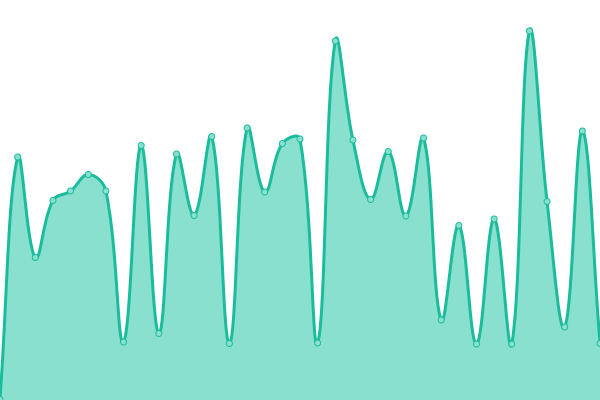
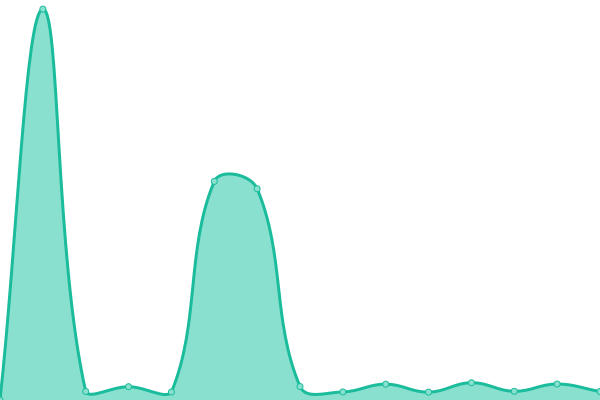
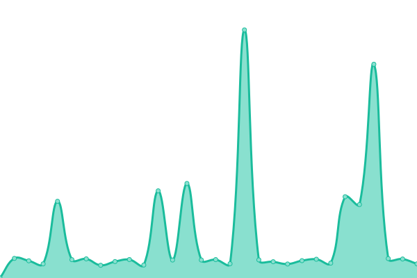
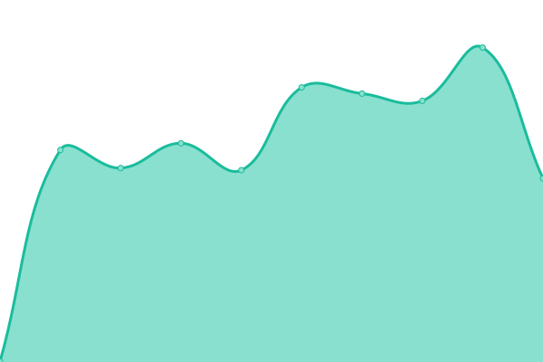

# [📈 Live Status](https://LightingControl.github.io/devmonitor): <!--live status--> **🟧 Partial outage**

This repository contains the open-source uptime monitor and status page for [LCD ](https://LightingControl.github.io/devmonitor), powered by [Upptime](https://github.com/upptime/upptime).

With [Upptime](https://upptime.js.org), you can get your own unlimited and free uptime monitor and status page, powered entirely by a GitHub repository. We use [Issues](https://github.com/LightingControl/devmonitor/issues) as incident reports, [Actions](https://github.com/LightingControl/devmonitor/actions) as uptime monitors, and [Pages](https://LightingControl.github.io/devmonitor) for the status page.

<!--start: status pages-->
<!-- This summary is generated by Upptime (https://github.com/upptime/upptime) -->
<!-- Do not edit this manually, your changes will be overwritten -->
<!-- prettier-ignore -->
| URL | Status | History | Response Time | Uptime |
| --- | ------ | ------- | ------------- | ------ |
|  [API DEV](https://api-dev.centro.network/swagger/index.html) | 🟥 Down | [api-dev.yml](https://github.com/LightingControl/devmonitor/commits/HEAD/history/api-dev.yml) | 

 5068ms
     
 | 

<a href="https://devmon.centro.network/history/api-dev">97.62%</a>
    

|  [Frontend DEV](https://dev.centro.network) | 🟩 Up | [frontend-dev.yml](https://github.com/LightingControl/devmonitor/commits/HEAD/history/frontend-dev.yml) | 

 852ms
     
 | 

<a href="https://devmon.centro.network/history/frontend-dev">100.00%</a>
    

|  [App DEV](https://app-dev.centro.network) | 🟩 Up | [app-dev.yml](https://github.com/LightingControl/devmonitor/commits/HEAD/history/app-dev.yml) | 

 474ms
     
 | 

<a href="https://devmon.centro.network/history/app-dev">100.00%</a>
    

|  [API DEMO](https://api-demo.centro.network/swagger/index.html) | 🟩 Up | [api-demo.yml](https://github.com/LightingControl/devmonitor/commits/HEAD/history/api-demo.yml) | 

 470ms
     
 | 

<a href="https://devmon.centro.network/history/api-demo">96.68%</a>
    

|  [Frontend DEMO](https://demo.centro.network) | 🟩 Up | [frontend-demo.yml](https://github.com/LightingControl/devmonitor/commits/HEAD/history/frontend-demo.yml) | 

 1562ms
     
 | 

<a href="https://devmon.centro.network/history/frontend-demo">100.00%</a>
    

|  [App DEMO](https://app-demo.centro.network) | 🟩 Up | [app-demo.yml](https://github.com/LightingControl/devmonitor/commits/HEAD/history/app-demo.yml) | 

 5057ms
     
 | 

<a href="https://devmon.centro.network/history/app-demo">98.69%</a>
    

|  [API DEMO](https://api-demo.centro.network/swagger/index.html) | 🟩 Up | [api-demo.yml](https://github.com/LightingControl/devmonitor/commits/HEAD/history/api-demo.yml) | 

 470ms
     
 | 

<a href="https://devmon.centro.network/history/api-demo">96.68%</a>
    

|  [Frontend DEMO](https://demo.centro.network) | 🟩 Up | [frontend-demo.yml](https://github.com/LightingControl/devmonitor/commits/HEAD/history/frontend-demo.yml) | 

 1562ms
     
 | 

<a href="https://devmon.centro.network/history/frontend-demo">100.00%</a>
    

|  [App DEMO](https://app-demo.centro.network) | 🟩 Up | [app-demo.yml](https://github.com/LightingControl/devmonitor/commits/HEAD/history/app-demo.yml) | 

 5057ms
     
 | 

<a href="https://devmon.centro.network/history/app-demo">98.69%</a>
    

|  [ADMIN PANEL](https://admin.centro.network) | 🟩 Up | [admin-panel.yml](https://github.com/LightingControl/devmonitor/commits/HEAD/history/admin-panel.yml) | 

 806ms
     
 | 

<a href="https://devmon.centro.network/history/admin-panel">100.00%</a>
    

|  [ADMIN STRAPI](https://strapi.centro.network) | 🟩 Up | [admin-strapi.yml](https://github.com/LightingControl/devmonitor/commits/HEAD/history/admin-strapi.yml) | 

 507ms
     
 | 

<a href="https://devmon.centro.network/history/admin-strapi">99.91%</a>
    

<!--end: status pages-->

[**Visit our status website →**](https://LightingControl.github.io/devmonitor)

## 📄 License

- Powered by: [Upptime](https://github.com/upptime/upptime)
- Code: [MIT](./LICENSE) © [Anand Chowdhary](https://anandchowdhary.com), supported by [Pabio](https://pabio.com)
- Data in the `./history` directory: [Open Database License](https://opendatacommons.org/licenses/odbl/1-0/)
